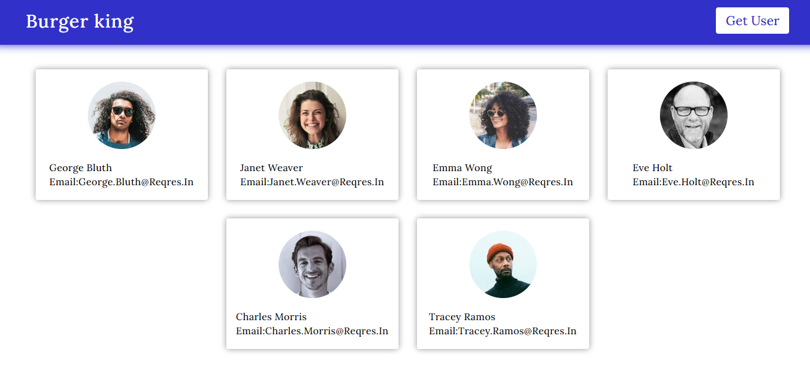

# <h1 align="center">Burger king Advertisement</h1>

<p align="center">This is a Burger king advertisement webiste.</p>

## tools and technologies used


## [live demo](https://nidhisharma63.github.io/Burger-king-advertisement/)

## Demo Screenshots



## About
* I've created this using `react` `scss` `js` and using `react-loader-spinner` library to show loader each time when `Api` request is send.

## How it work
* Initially, it shows the empty user grid-layout.

* When user click on the `Get user` btn then it make the api request to fetch the user data after that it display the users.

* You can use the pagination to see the more users.


## Prerequisites
 Before you begin, ensure you have met the following requirements:

 * [Git](https://git-scm.com/downloads "Download Git") must be installed on your operating system.

## Run Locally
To run Homeverse locally, run this command on your git bash:
Linux and macOS:

```bash
sudo git clone https://github.com/NidhiSharma63/Burger-king-advertisement.git
```
Windows:

```bash
git clone https://github.com/NidhiSharma63/Burger-king-advertisement.git
```

### Available scripts

`npm i` and `npm start`

## [live demo](https://nidhisharma63.github.io/Burger-king-advertisement/)
